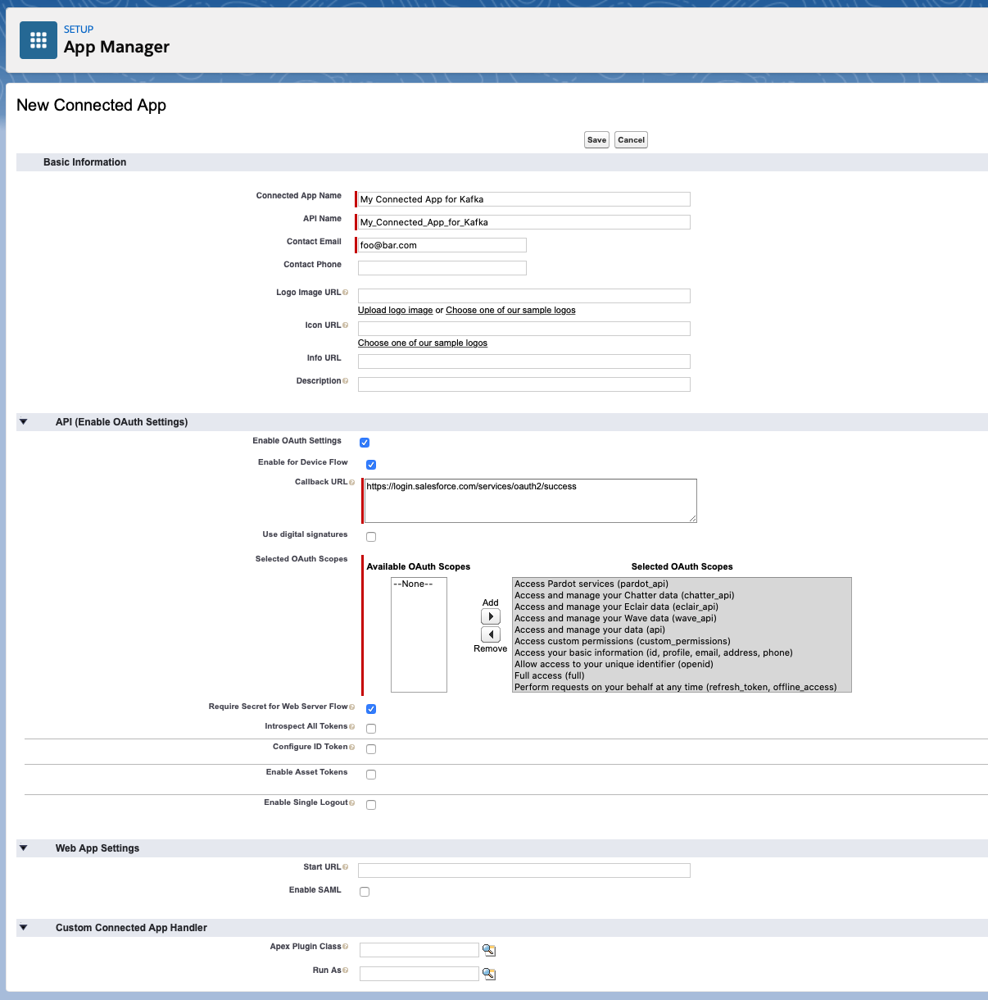

# Salesforce Bulk API Sink connector


## Objective

Quickly test [Salesforce Bulk API Sink](https://docs.confluent.io/current/connect/kafka-connect-salesforce-bulk-api/sink/index.html#salesforce-bulk-api-sink-connector-for-cp) connector.


## Register a test account

Go to [Salesforce developer portal](https://developer.salesforce.com/signup/) and register an account.

## Register another test account

Go to [Salesforce developer portal](https://developer.salesforce.com/signup/) and register an account.

## Salesforce Account

### Create a new Connected App

Full details available [here](https://docs.confluent.io/current/connect/kafka-connect-salesforce/pushtopics/salesforce_pushtopic_source_connector_quickstart.html#salesforce-account)

Steps are:

* Select the gear icon in the upper right hand corner and choose Setup.

* Enter App in the Quick Find search box, and choose *App Manager* in the filtered results.

* Click the *New Connected App* button in the upper right corner of the Setup panel.


* Supply a Connected App Name, API Name, and Contact Email.

* Select *Enable OAuth Settings* checkbox and select the *Enable for Device Flow* checkbox. These selections enable the connector to use the Salesforce API.
* Under the *Select OAuth Scopes* field, select all of the items under Available OAuth scopes and add them to the *Selected OAuth Scopes*.

Example:



* Save the new app and press Continue at the prompt.
* Look for the Consumer Key and Consumer Secret in the displayed form. Save these so you can put them in the configuration properties file for the Salesforce connect worker.

### Find your Security token

Find your Security Token (emailed to you from Salesforce.com). If you need to reset your token or view your profile on Salesforce.com, select `Settings->My Personal Information->Reset My Security Token` and follow the instructions.


## How to run

Simply run:

```
$ ./salesforce-bulkapi-sink-with-bulkapi-source.sh <SALESFORCE_USERNAME> <SALESFORCE_PASSWORD> <CONSUMER_KEY> <CONSUMER_PASSWORD> <SECURITY_TOKEN> <SALESFORCE_USERNAME_ACCOUNT2> <SALESFORCE_PASSWORD_ACCOUNT2> <SECURITY_TOKEN_ACCOUNT2>
```

Note: you can also export these values as environment variable

Note: There is also an example with PushTopics source in `salesforce-bulkapi-sink-with-pushtopics-source.sh`

## Details of what the script is doing

The Salesforce PushTopic source connector is used to get data into Kafka and the Salesforce Bulk API sink connector is used to export data from Kafka to Salesforce

Login with sfdx CLI

```bash
$ docker exec sfdx-cli sh -c "sfdx sfpowerkit:auth:login -u \"$SALESFORCE_USERNAME\" -p \"$SALESFORCE_PASSWORD\" -r \"$SALESFORCE_INSTANCE\" -s \"$SECURITY_TOKEN\""
```

Create MyLeadPushTopics

```bash
$ docker exec sfdx-cli sh -c "sfdx force:apex:execute  -u \"$SALESFORCE_USERNAME\" -f \"/tmp/MyLeadPushTopics.apex\""
```

Add a Lead to Salesforce

```bash
$ docker exec sfdx-cli sh -c "sfdx force:data:record:create  -u \"$SALESFORCE_USERNAME\" -s Lead -v \"FirstName='$LEAD_FIRSTNAME' LastName='$LEAD_LASTNAME' Company=Confluent\""
```

Creating Salesforce Bulk API Source connector

```bash
$ curl -X PUT \
     -H "Content-Type: application/json" \
     --data '{
                    "connector.class": "io.confluent.connect.salesforce.SalesforceBulkApiSourceConnector",
                    "kafka.topic": "sfdc-bulkapi-leads",
                    "tasks.max": "1",
                    "curl.logging": "true",
                    "salesforce.object" : "Lead",
                    "salesforce.instance" : "'"$SALESFORCE_INSTANCE"'",
                    "salesforce.username" : "'"$SALESFORCE_USERNAME"'",
                    "salesforce.password" : "'"$SALESFORCE_PASSWORD"'",
                    "salesforce.password.token" : "'"$SECURITY_TOKEN"'",
                    "key.converter": "org.apache.kafka.connect.json.JsonConverter",
                    "value.converter": "org.apache.kafka.connect.json.JsonConverter",
                    "confluent.license": "",
                    "confluent.topic.bootstrap.servers": "broker:9092",
                    "confluent.topic.replication.factor": "1"
          }' \
     http://localhost:8083/connectors/salesforce-bulkapi-source/config | jq .
```

Verify we have received the data in `sfdc-bulkapi-leads` topic

```bash
$ docker exec broker kafka-console-consumer -bootstrap-server broker:9092 --topic sfdc-bulkapi-leads --from-beginning --max-messages 1
```

Creating Salesforce Bulk API Sink connector

```bash
$ curl -X PUT \
     -H "Content-Type: application/json" \
     --data '{
                    "connector.class": "io.confluent.connect.salesforce.SalesforceBulkApiSinkConnector",
                    "topics": "sfdc-bulkapi-leads",
                    "tasks.max": "1",
                    "curl.logging": "true",
                    "salesforce.object" : "Lead",
                    "salesforce.instance" : "'"$SALESFORCE_INSTANCE_ACCOUNT2"'",
                    "salesforce.username" : "'"$SALESFORCE_USERNAME_ACCOUNT2"'",
                    "salesforce.password" : "'"$SALESFORCE_PASSWORD_ACCOUNT2"'",
                    "salesforce.password.token" : "'"$SECURITY_TOKEN_ACCOUNT2"'",
                    "salesforce.ignore.fields" : "CleanStatus",
                    "salesforce.ignore.reference.fields" : "true",
                    "key.converter": "org.apache.kafka.connect.json.JsonConverter",
                    "value.converter": "org.apache.kafka.connect.json.JsonConverter",
                    "reporter.bootstrap.servers": "broker:9092",
                    "reporter.error.topic.name": "error-responses",
                    "reporter.error.topic.replication.factor": 1,
                    "reporter.result.topic.name": "success-responses",
                    "reporter.result.topic.replication.factor": 1,
                    "transforms" : "InsertField",
                    "transforms.InsertField.type" : "org.apache.kafka.connect.transforms.InsertField$Value",
                    "transforms.InsertField.static.field" : "_EventType",
                    "transforms.InsertField.static.value" : "created",
                    "confluent.license": "",
                    "confluent.topic.bootstrap.servers": "broker:9092",
                    "confluent.topic.replication.factor": "1"
          }' \
     http://localhost:8083/connectors/salesforce-bulkapi-sink/config | jq .
````

Verify topic `success-responses`

```bash
docker exec broker kafka-console-consumer -bootstrap-server broker:9092 --topic success-responses --from-beginning --max-messages 1
```

```
"{Id: 00Q2X00001OUcZgUAL ,Success: true ,Created: true}"
Processed a total of 1 messages
```

Login with sfdx CLI on the account #2

```bash
$ docker exec sfdx-cli sh -c "sfdx sfpowerkit:auth:login -u \"$SALESFORCE_USERNAME_ACCOUNT2\" -p \"$SALESFORCE_PASSWORD_ACCOUNT2\" -r \"$SALESFORCE_INSTANCE_ACCOUNT2\" -s \"$SECURITY_TOKEN_ACCOUNT2\""
```

Get the Lead created on account #2

```bash
docker exec sfdx-cli sh -c "sfdx force:data:record:get  -u \"$SALESFORCE_USERNAME_ACCOUNT2\" -s Lead -w \"FirstName='$LEAD_FIRSTNAME' LastName='$LEAD_LASTNAME' Company=Confluent\""
```

Results:

```
attributes:
  type: "Lead"
  url: "/services/data/v49.0/sobjects/Lead/00Q2X00001OUd8RUAT"
Id: "00Q2X00001OUd8RUAT"
IsDeleted: null
MasterRecordId: null
LastName: "Doe_20857"
FirstName: "John_64"
Salutation: null
Name: "John_64 Doe_20857"
Title: null
Company: "Confluent"
Street: null
City: null
State: null
PostalCode: null
Country: null
Latitude: null
Longitude: null
GeocodeAccuracy: null
Address: null
Phone: null
MobilePhone: null
Fax: null
Email: null
Website: null
PhotoUrl: "/services/images/photo/00Q2X00001OUd8RUAT"
Description: null
LeadSource: null
Status: "Open - Not Contacted"
Industry: null
Rating: null
AnnualRevenue: null
NumberOfEmployees: null
OwnerId: "0052X00000ANeP4QAL"
IsConverted: null
ConvertedDate: null
ConvertedAccountId: null
ConvertedContactId: null
ConvertedOpportunityId: null
IsUnreadByOwner: true
CreatedDate: "2020-07-30T14:31:22.000+0000"
CreatedById: "0052X00000ANeP4QAL"
LastModifiedDate: "2020-07-30T14:31:22.000+0000"
LastModifiedById: "0052X00000ANeP4QAL"
SystemModstamp: "2020-07-30T14:31:22.000+0000"
LastActivityDate: null
LastViewedDate: null
LastReferencedDate: null
Jigsaw: null
JigsawContactId: null
CleanStatus: "Pending"
CompanyDunsNumber: null
DandbCompanyId: null
EmailBouncedReason: null
EmailBouncedDate: null
IndividualId: null
SICCode__c: null
ProductInterest__c: null
Primary__c: null
CurrentGenerators__c: null
NumberofLocations__c: null
```


N.B: Control Center is reachable at [http://127.0.0.1:9021](http://127.0.0.1:9021])
